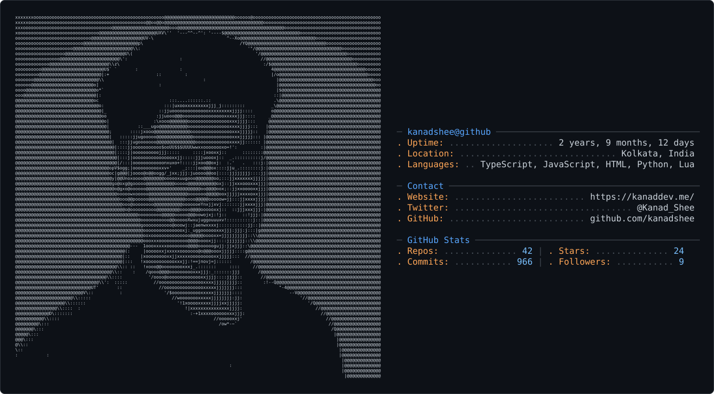

<h1>Kanad Shee</h1>

<h4>
  Full-Stack Developer · AI Engineering Enthusiast
</h4>

  <a href="https://kanaddev.me">Website</a>
  ·
  <a href="https://github.com/kanadshee">GitHub</a>
  ·
  <a href="https://www.linkedin.com/in/kanadshee">LinkedIn</a>
  ·
  <a href="https://leetcode.com/kanad_shee">LeetCode</a>
  .
  <a href="https://twitter.com/kanad_shee">X / Twitter</a>

  I'm a Full-Stack Developer focused on building reliable, scalable web applications and exploring AI engineering.

  I enjoy working across the stack — from designing interfaces and APIs to databases, distributed systems, real-time applications, and cloud infrastructure.

  <picture>
    <source media="(prefers-color-scheme: dark)" srcset="dark_mode.svg">
    <source media="(prefers-color-scheme: light)" srcset="light_mode.svg">
    
  </picture>

---

## What I Build

| Web Applications       | AI Engineering        | Backend & Infrastructure |
| :--------------------- | :-------------------- | :----------------------- |
| Modern frontends       | RAG systems           | PostgreSQL / MongoDB     |
| REST / RPC APIs        | LLM applications      | Redis                    |
| Authentication         | AI agents             | Kafka / RabbitMQ         |
| Real-time applications | Document intelligence | Docker / Kubernetes      |
| Production deployments | Developer tools       | Cloud infrastructure     |

---

## Tech Stack

### Languages

  

### Frontend

  

### Backend & Data

  

### AI Engineering

  
  
  
  

### DevOps, Cloud & Tools

  

---

## Currently Learning

- **AI Engineering** — LLMs, RAG, agents and AI-powered applications
- **Backend Engineering** — APIs, databases, distributed systems and real-time architectures
- **Cloud & DevOps** — Docker, Kubernetes, CI/CD and cloud infrastructure
- **System Design** — scalable services, messaging and event-driven systems

  Build things. Understand how they work. Keep improving.

